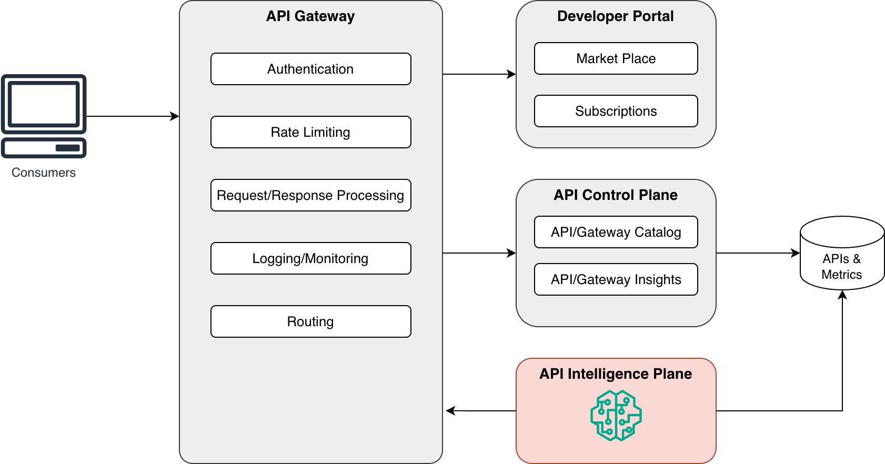

# API Intelligence Plane

> AI-driven API management platform that transforms API operations from reactive firefighting to proactive, autonomous management.

[](https://opensource.org/licenses/MIT)
[](https://www.python.org/downloads/)
[](https://reactjs.org/)
[](https://openjdk.org/)

## Overview

API Intelligence Plane is an intelligent companion to existing API Gateways, providing:

- 🔍 **Autonomous API Discovery** - Automatically discover all APIs including shadow APIs
- 🔮 **Predictive Health Management** - 24-48 hour advance failure predictions
- 🔒 **Continuous Security Scanning** - Automated vulnerability detection and remediation
- ⚡ **Real-time Performance Optimization** - AI-driven performance recommendations
- 🎯 **Intelligent Rate Limiting** - Adaptive rate limiting based on usage patterns
- 💬 **Natural Language Interface** - Query API intelligence using natural language

## Architecture

The API Intelligence Plane is a microservices-based platform with clear separation between the core application and optional external agent integrations.

### Core Application Architecture


### Optional: External AI Agent Integration

MCP servers are **optional** components for external AI agents (Bob IDE, Claude Desktop):


**Note**: MCP servers are NOT required for core functionality. They only enable external AI agents to interact with the platform programmatically.

📖 **See [Architecture Documentation](docs/architecture.md) for detailed system design and [MCP Architecture](docs/mcp-architecture.md) for AI agent integration.**

### Positioning in API management platform



## Quick Start

### Prerequisites

- Docker & Docker Compose
- Python 3.11+
- Node.js 18+
- Java 17+
- OpenAI API key (or other LLM provider)

### Installation

1. **Clone the repository**
   ```bash
   git clone https://github.com/yourusername/api-intelligence-plane-v2.git
   cd api-intelligence-plane-v2
   ```

2. **Configure environment**
   ```bash
   cp .env.example .env
   # Edit .env and add your LLM API keys
   ```

3. **Start services with Docker Compose**
   ```bash
   docker-compose up -d
   ```

4. **Initialize OpenSearch indices**
   ```bash
   docker-compose exec backend python scripts/init_opensearch.py
   ```

5. **Access the application**
   - Frontend: http://localhost:3000
   - Backend API: http://localhost:8000
   - OpenSearch Dashboards: http://localhost:5601
   - Demo Gateway: http://localhost:8080

### Manual Setup (Development)

#### Backend Setup

```bash
cd backend
python -m venv .venv
source .venv/bin/activate  # On Windows: .venv\Scripts\activate
pip install -r requirements.txt
uvicorn app.main:app --reload
```

#### Frontend Setup

```bash
cd frontend
npm install
npm run dev
```

#### Demo Gateway Setup

```bash
cd demo-gateway
mvn clean install
mvn spring-boot:run
```

## Project Structure

```
api-intelligence-plane-v2/
├── backend/              # FastAPI backend service (REQUIRED)
│   ├── app/
│   │   ├── api/         # REST API endpoints
│   │   ├── models/      # Pydantic models
│   │   ├── services/    # Business logic
│   │   ├── agents/      # LangChain/LangGraph agents
│   │   ├── adapters/    # Gateway adapters
│   │   ├── db/          # OpenSearch client
│   │   └── scheduler/   # Background jobs
│   └── tests/           # Integration & E2E tests
├── frontend/            # React.js frontend (REQUIRED)
│   └── src/
│       ├── components/  # React components
│       ├── pages/       # Page components
│       └── services/    # API clients
├── demo-gateway/        # Demo API Gateway (REQUIRED)
│   └── src/main/java/   # Spring Boot application
├── mcp-servers/         # MCP servers (OPTIONAL - for AI agents)
│   ├── discovery_server.py
│   ├── metrics_server.py
│   └── optimization_server.py
├── tests/               # Cross-component tests
├── config/              # Configuration files
├── k8s/                 # Kubernetes manifests
└── docs/                # Documentation
```

**Core Components** (Required):
- **Backend**: FastAPI service with business logic
- **Frontend**: React SPA for user interface
- **Demo Gateway**: Native API Gateway implementation
- **OpenSearch**: Data storage and search

**Optional Components**:
- **MCP Servers**: For external AI agent integration (Bob IDE, Claude Desktop)

## Features

### 1. API Discovery & Monitoring (P1)
- Automatic discovery of all APIs including shadow APIs
- Real-time health monitoring
- Traffic analysis and metrics collection

### 2. Predictive Health Management (P1)
- 24-48 hour advance failure predictions
- Contributing factors analysis
- Recommended preventive actions
- **🤖 AI-Enhanced**: LLM-powered trend analysis and detailed explanations

### 3. Security Scanning & Remediation (P2)
- Continuous vulnerability scanning
- Automated remediation for common issues
- Security posture tracking

### 4. Performance Optimization (P2)
- Real-time optimization recommendations
- Estimated impact analysis
- Implementation tracking
- **🤖 AI-Enhanced**: LLM-generated insights and prioritization guidance

### 5. Intelligent Rate Limiting (P3)
- Adaptive rate limiting
- Priority-based policies
- Consumer tier management

### 6. Natural Language Interface (P3)
- Query API intelligence using natural language
- Contextual responses
- Conversation history

### 🆕 AI-Enhanced Analysis

The platform includes optional AI-powered features that enhance predictions and recommendations:

- **Smart Predictions**: LLM analyzes metrics trends to provide detailed explanations of why failures are predicted
- **Intelligent Recommendations**: AI-generated optimization insights with implementation guidance and prioritization
- **Natural Language Explanations**: Human-readable interpretations of technical predictions
- **Graceful Fallback**: Automatically falls back to rule-based analysis if LLM is unavailable

**Setup**: See [AI Setup Guide](docs/ai-setup.md) for configuration instructions.

**API Endpoints**:
- `POST /api/v1/predictions/ai-enhanced` - Generate AI-enhanced predictions
- `GET /api/v1/predictions/{id}/explanation` - Get AI explanation for prediction
- `POST /api/v1/optimization/ai-enhanced` - Generate AI-enhanced recommendations
- `GET /api/v1/optimization/{id}/insights` - Get AI insights for recommendation
- Add `?use_ai=true` to existing endpoints for AI-enhanced generation

## Technology Stack

- **Backend**: Python 3.11+, FastAPI, LangChain, LangGraph, LiteLLM
- **Frontend**: React 18, TypeScript, Vite, TanStack Query, Recharts, Tailwind CSS
- **MCP**: FastMCP with Streamable HTTP transport
- **Demo Gateway**: Java 17, Spring Boot 3.2
- **Database**: OpenSearch 2.18
- **AI/ML**: LangChain for agent orchestration, LiteLLM for multi-provider support
- **Testing**: pytest, Jest, JUnit

## Development

### Generating Mock Data

For testing and demonstration purposes, you can generate realistic mock data:

```bash
# Generate mock APIs, gateways, and metrics
cd backend
python3 scripts/generate_mock_data.py

# Generate security vulnerabilities (50 by default)
python3 scripts/generate_mock_security_data.py --count 50 --summary

# Generate predictions
python3 scripts/generate_mock_predictions.py

# Generate optimization recommendations
python3 scripts/generate_mock_optimizations.py

# Generate rate limit policies
python3 scripts/generate_mock_rate_limits.py
```

See [`backend/scripts/README_SECURITY_MOCK_DATA.md`](backend/scripts/README_SECURITY_MOCK_DATA.md) for detailed security mock data documentation.

### Running Tests

```bash
# Backend tests
cd backend
pytest

# Frontend tests
cd frontend
npm test

# Integration tests
cd tests
pytest integration/

# E2E tests
pytest e2e/
```

### Code Quality

```bash
# Backend linting
cd backend
black .
isort .
flake8 .
mypy .

# Frontend linting
cd frontend
npm run lint
npm run format
```

## Configuration

Key configuration options in `.env`:

- `OPENSEARCH_HOST` - OpenSearch connection
- `LLM_PROVIDER` - Primary LLM provider (openai, anthropic, azure, etc.)
- `LLM_API_KEY` - LLM API key
- `DISCOVERY_INTERVAL` - API discovery frequency (minutes)
- `METRICS_INTERVAL` - Metrics collection frequency (minutes)
- `SECURITY_SCAN_INTERVAL` - Security scan frequency (minutes)

See [`.env.example`](.env.example) for all configuration options.

## Documentation

### Core Documentation

- [Architecture Documentation](docs/architecture.md) - System architecture, design patterns, and component details
- [API Reference](docs/api-reference.md) - Complete REST API documentation with examples
- [Deployment Guide](docs/deployment.md) - Local, Docker, and Kubernetes deployment instructions
- [Contributing Guidelines](docs/contributing.md) - How to contribute to the project

### Additional Guides

- [AI Setup Guide](docs/ai-setup.md) - Configure AI-enhanced features with LLM providers
- [MCP Architecture](docs/mcp-architecture.md) - MCP server architecture for external AI agents (optional)
- [MCP Usage Guide](docs/mcp-usage-guide.md) - Using MCP servers with Bob IDE and Claude Desktop (optional)
- [TLS Deployment](docs/tls-deployment.md) - Secure deployment with TLS/SSL
- [OpenSearch Encryption](docs/opensearch-encryption.md) - Data encryption configuration
- [Query Service](docs/query-service.md) - Natural language query interface details

## Roadmap

### Completed ✅

- [x] **Phase 1**: Setup & Infrastructure
- [x] **Phase 2**: Foundational Components (OpenSearch, Backend Core, Models, Adapters)
- [x] **Phase 3**: User Story 1 - Discovery & Monitoring
- [x] **Phase 4**: User Story 2 - Predictive Health Management
- [x] **Phase 5**: User Story 3 - Security Scanning & Remediation
- [x] **Phase 6**: User Story 4 - Performance Optimization
- [x] **Phase 7**: User Story 5 - Intelligent Rate Limiting
- [x] **Phase 8**: User Story 6 - Natural Language Interface
- [x] **Phase 9**: Polish & Cross-Cutting Concerns
- [x] **Phase 10**: AI-Enhanced Analysis (LLM Integration)
- [x] **Phase 11**: Query Service Agent Integration

### In Progress 🚧

- [ ] **Phase 12**: Production Hardening
  - [ ] Authentication & Authorization
  - [ ] Advanced monitoring and alerting
  - [ ] Performance optimization
  - [ ] Load testing and benchmarking

### Planned 📋

- [ ] **Multi-Gateway Support**: Kong, Apigee, AWS API Gateway
- [ ] **Advanced Analytics**: ML model training, anomaly detection
- [ ] **Multi-Tenancy**: Tenant isolation and resource quotas
- [ ] **Cost Optimization**: Cloud cost analysis and recommendations

## Contributing

We welcome contributions from the community! Whether you're fixing bugs, adding features, improving documentation, or helping with testing, your contributions are valuable.

### How to Contribute

1. **Read the Guidelines**: Check our [Contributing Guidelines](docs/contributing.md)
2. **Find an Issue**: Look for issues labeled `good-first-issue` or `help-wanted`
3. **Fork & Clone**: Fork the repository and clone it locally
4. **Create a Branch**: Create a feature branch for your changes
5. **Make Changes**: Implement your changes following our coding standards
6. **Test**: Run tests and ensure they pass
7. **Submit PR**: Create a pull request with a clear description

### Development Setup

```bash
# Clone the repository
git clone https://github.com/yourusername/api-intelligence-plane-v2.git
cd api-intelligence-plane-v2

# Start development environment
docker-compose up -d

# Initialize database
docker-compose exec backend python scripts/init_opensearch.py
```

### Code Quality

We maintain high code quality standards:

- **Python**: Black, isort, flake8, mypy
- **TypeScript**: ESLint, Prettier
- **Java**: Google Java Style Guide
- **Tests**: Integration and E2E tests required

For detailed guidelines, see [Contributing Guidelines](docs/contributing.md).

## Performance & Scale

### Current Capabilities

- **APIs Supported**: 1000+ APIs tested
- **Query Latency**: ~3 seconds average
- **Discovery Cycle**: ~3 minutes
- **Security Scan**: ~45 minutes
- **Data Retention**: 90 days configured
- **Concurrent Requests**: Designed for millions/minute

### Scalability

The platform is designed for horizontal scaling:

- **Stateless Services**: Backend and frontend scale independently
- **Distributed Storage**: OpenSearch cluster for data distribution
- **Load Balancing**: Support for multiple backend replicas
- **Caching**: Redis integration for improved performance

## Security & Compliance

### Security Features

- **Encryption in Transit**: TLS 1.3 for all communications
- **Encryption at Rest**: OpenSearch data encryption
- **FedRAMP 140-3**: NIST-approved cryptographic algorithms
- **Audit Logging**: Comprehensive operation logging
- **No Hardcoded Secrets**: Environment-based configuration

### Compliance

- **FedRAMP 140-3**: Compliant cryptography and encryption
- **Security Scanning**: Continuous vulnerability detection
- **Automated Remediation**: Common security issues auto-fixed

**Note**: Authentication and authorization are planned for production deployment.

## License

This project is licensed under the MIT License - see the [LICENSE](LICENSE) file for details.

## Support & Community

### Get Help

- 📧 **Email**: support@api-intelligence-plane.com
- 💬 **Discord**: [Join our community](https://discord.gg/api-intelligence-plane)
- 🐛 **Issues**: [GitHub Issues](https://github.com/yourusername/api-intelligence-plane-v2/issues)
- 💡 **Discussions**: [GitHub Discussions](https://github.com/yourusername/api-intelligence-plane-v2/discussions)

### Reporting Issues

When reporting issues, please include:

1. **Description**: Clear description of the problem
2. **Steps to Reproduce**: Detailed steps to reproduce the issue
3. **Expected Behavior**: What you expected to happen
4. **Actual Behavior**: What actually happened
5. **Environment**: OS, Docker version, browser, etc.
6. **Logs**: Relevant log output
7. **Screenshots**: If applicable

### Feature Requests

We welcome feature requests! Please:

1. Check existing issues first
2. Describe the use case
3. Explain the expected benefit
4. Provide examples if possible

## Acknowledgments

### Technologies

- **Backend Framework**: [FastAPI](https://fastapi.tiangolo.com/) - Modern Python web framework
- **AI/ML**: [LangChain](https://www.langchain.com/) & [LangGraph](https://langchain-ai.github.io/langgraph/) - AI agent orchestration
- **LLM Integration**: [LiteLLM](https://github.com/BerriAI/litellm) - Multi-provider LLM support
- **Frontend**: [React](https://reactjs.org/) & [Vite](https://vitejs.dev/) - Modern web development
- **UI Components**: [Tailwind CSS](https://tailwindcss.com/) - Utility-first CSS framework
- **Data Visualization**: [Recharts](https://recharts.org/) - React charting library
- **Data Storage**: [OpenSearch](https://opensearch.org/) - Search and analytics engine
- **MCP Protocol**: [FastMCP](https://github.com/jlowin/fastmcp) - Model Context Protocol implementation (optional)
- **Demo Gateway**: [Spring Boot](https://spring.io/projects/spring-boot) - Java application framework

### Contributors

Thank you to all contributors who have helped build this project! 🙏

See [Contributors](https://github.com/yourusername/api-intelligence-plane-v2/graphs/contributors) for the full list.

### Inspiration

This project was inspired by the need for proactive, AI-driven API management that transforms operations from reactive firefighting to autonomous, intelligent operations.

---

**Status**: ✅ Production Ready | **Version**: 1.0.0 | **Last Updated**: 2026-03-12

**Built with ❤️ by the API Intelligence Plane Team**
