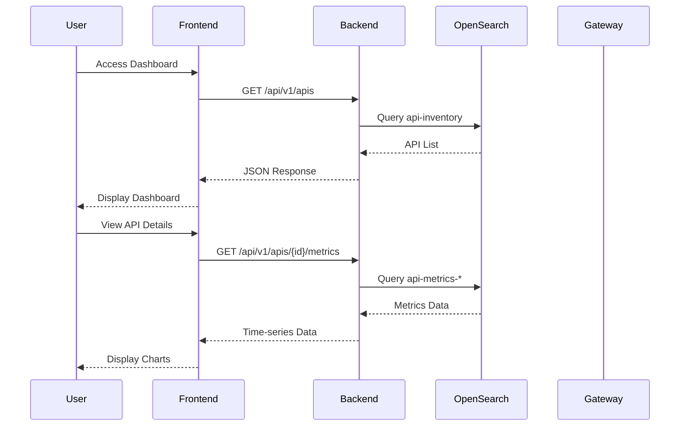
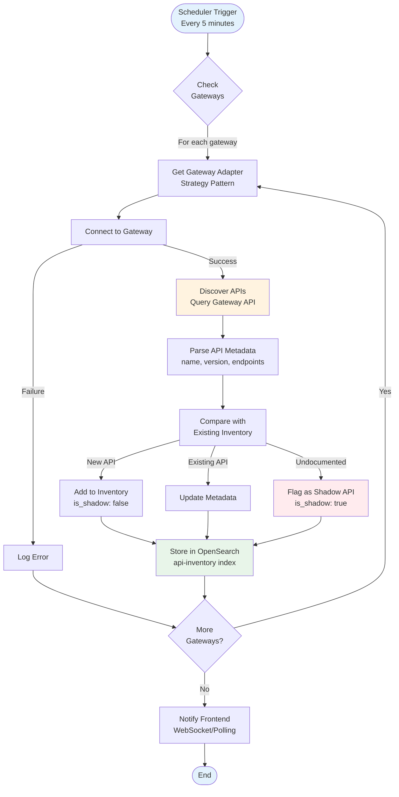
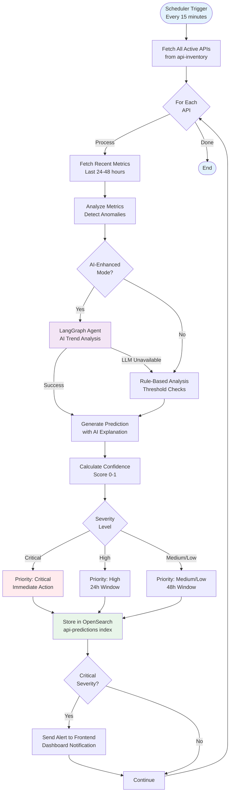
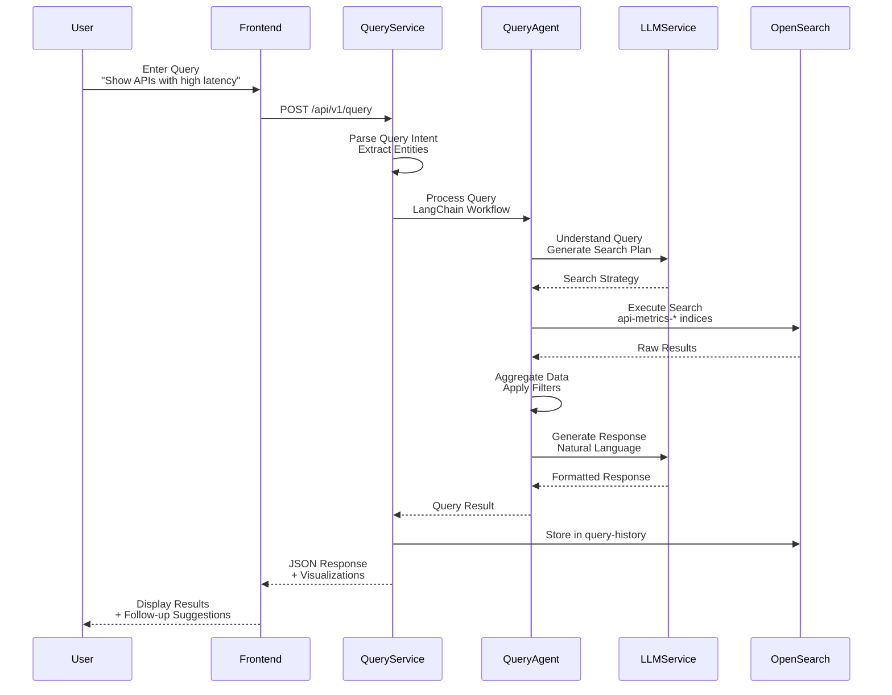
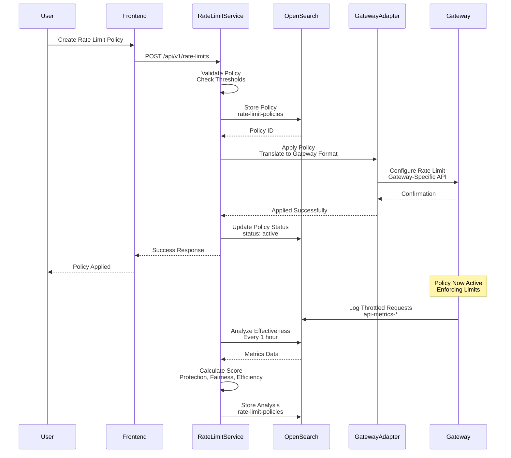
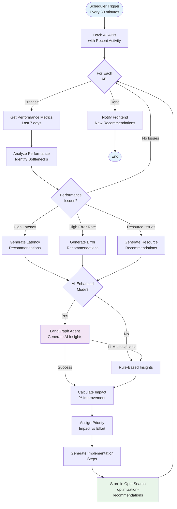

# Data Flow Diagrams

## Core Application Data Flow



## API Discovery Flow



## Prediction Generation Flow



## Natural Language Query Flow



## Metrics Collection Flow

```mermaid
flowchart LR
    subgraph "Scheduler"
        Timer[Every 1 Minute]
    end
    
    subgraph "Metrics Service"
        Trigger[Trigger Collection]
        GetAPIs[Get All APIs<br/>from Inventory]
        Collect[Collect Metrics<br/>via Gateway Adapter]
    end
    
    subgraph "Gateway Adapter"
        Connect[Connect to Gateway]
        Query[Query Metrics API]
        Parse[Parse Response]
    end
    
    subgraph "Data Processing"
        Validate[Validate Data]
        Enrich[Enrich with Metadata]
        Aggregate[Calculate Aggregates<br/>p50, p95, p99]
    end
    
    subgraph "Storage"
        Index[Store in OpenSearch<br/>api-metrics-YYYY-MM-DD]
        Rollover{Index Size<br/>>50GB?}
        NewIndex[Create New Index]
    end
    
    subgraph "Consumers"
        Dashboard[Frontend Dashboard]
        Predictions[Prediction Service]
        Optimization[Optimization Service]
    end
    
    Timer --> Trigger
    Trigger --> GetAPIs
    GetAPIs --> Collect
    Collect --> Connect
    Connect --> Query
    Query --> Parse
    Parse --> Validate
    Validate --> Enrich
    Enrich --> Aggregate
    Aggregate --> Index
    Index --> Rollover
    Rollover -->|Yes| NewIndex
    Rollover -->|No| Dashboard
    NewIndex --> Dashboard
    Dashboard --> Predictions
    Dashboard --> Optimization
    
    style Timer fill:#e3f2fd
    style Collect fill:#fff3e0
    style Index fill:#e8f5e9
    style Dashboard fill:#f3e5f5
```



## Rate Limit Policy Application Flow



## Optimization Recommendation Flow



## Data Persistence Architecture

```mermaid
graph TB
    subgraph "Application Layer"
        Services[Backend Services]
    end
    
    subgraph "Repository Layer"
        REPO_API[API Repository]
        REPO_GW[Gateway Repository]
        REPO_MET[Metrics Repository]
        REPO_PRED[Prediction Repository]
        REPO_REC[Recommendation Repository]
        REPO_RL[Rate Limit Repository]
        REPO_Q[Query Repository]
    end
    
    subgraph "OpenSearch Indices"
        IDX_API[(api-inventory<br/>Permanent)]
        IDX_GW[(gateway-registry<br/>Permanent)]
        IDX_MET[(api-metrics-*<br/>90 days)]
        IDX_PRED[(api-predictions<br/>90 days)]
        IDX_SEC[(security-findings<br/>90 days)]
        IDX_REC[(optimization-recommendations<br/>90 days)]
        IDX_RL[(rate-limit-policies<br/>Permanent)]
        IDX_Q[(query-history<br/>30 days)]
    end
    
    subgraph "Index Lifecycle"
        ILM[Index Lifecycle Management]
        Rollover[Daily Rollover<br/>Time-series Indices]
        Delete[Auto-delete After<br/>Retention Period]
        Snapshot[Daily Snapshots<br/>Backup]
    end
    
    Services --> REPO_API & REPO_GW & REPO_MET & REPO_PRED & REPO_REC & REPO_RL & REPO_Q
    
    REPO_API --> IDX_API
    REPO_GW --> IDX_GW
    REPO_MET --> IDX_MET
    REPO_PRED --> IDX_PRED & IDX_SEC
    REPO_REC --> IDX_REC
    REPO_RL --> IDX_RL
    REPO_Q --> IDX_Q
    
    IDX_MET & IDX_PRED & IDX_SEC & IDX_REC & IDX_Q --> ILM
    ILM --> Rollover
    ILM --> Delete
    ILM --> Snapshot
    
    style Services fill:#fff4e1
    style REPO_API fill:#e3f2fd
    style IDX_API fill:#e8f5e9
    style ILM fill:#f3e5f5